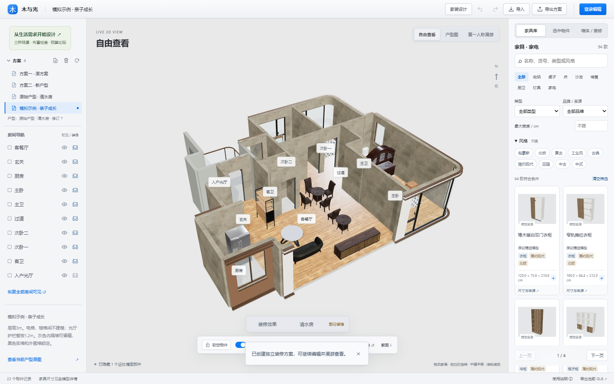
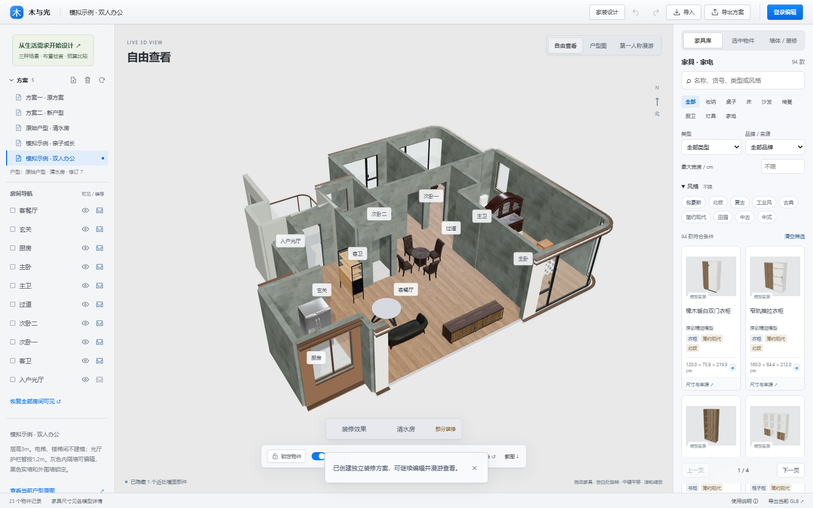
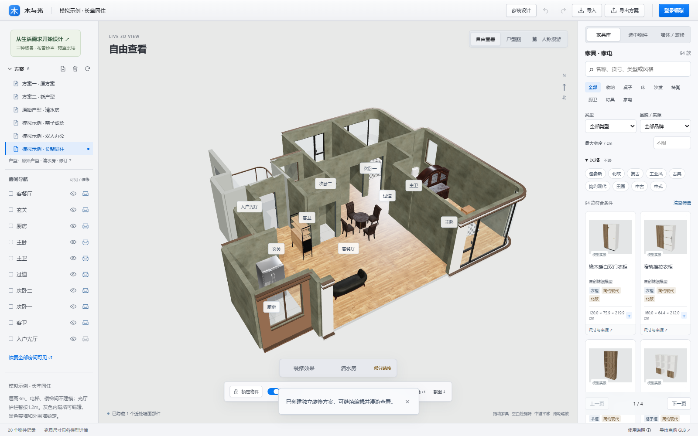
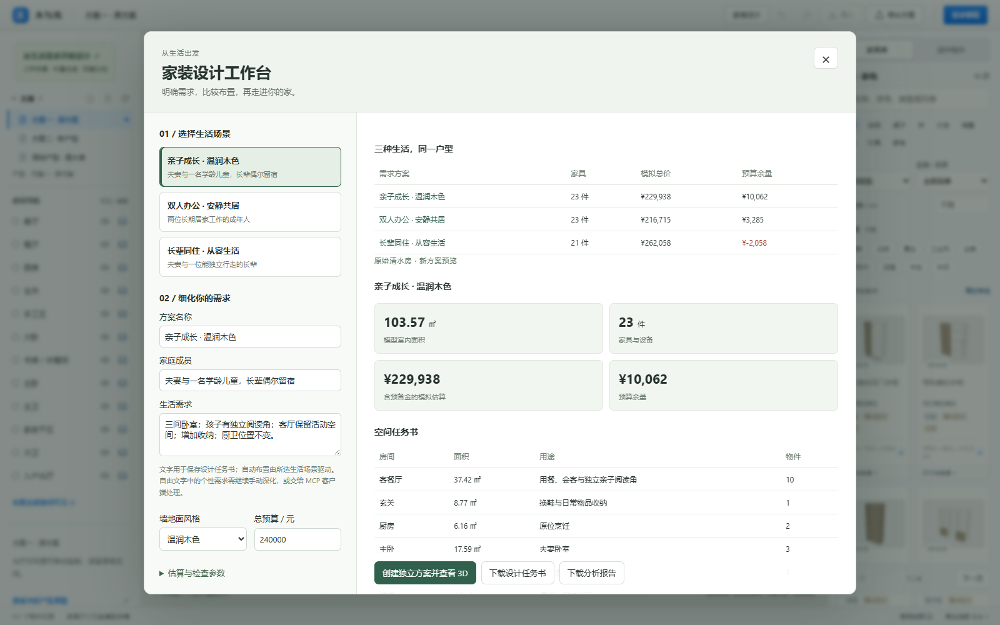

# 三种真实执行的模拟装修

执行日期：2026-09-16。户型：原始清水房，模型 revision 7，室内多边形面积 103.57 ㎡。通过官方 MCP Client 的 stdio 协议创建方案，再在软件中逐套打开、查看三维和平面、导出布局、刷新恢复并检查。

费用为软件模拟参数，**不是市场报价**。每套方案均包含任务书、实际摆放的目录模型、墙地面设置、费用和待深化清单。

| 用户需求 | 实际布置 | 家具与设备 | 预算 | 模拟总价 | 剩余 |
| --- | --- | ---: | ---: | ---: | ---: |
| 亲子成长 | 三卧室、儿童单人床、客厅亲子阅读桌椅、餐区与收纳 | 23 件 | ¥240,000 | ¥229,938 | ¥10,062 |
| 双人办公 | 主卧休息、两间独立工作室、升降桌与抽屉书桌 | 23 件 | ¥220,000 | ¥216,715 | ¥3,285 |
| 长辈同住 | 主卧给长辈、夫妻次卧、留宿房，减少客厅家具 | 20 件 | ¥260,000 | ¥257,498 | ¥2,502 |

## 方案一：亲子成长

**作为用户**：「我们夫妻和一名学龄儿童生活在这里，长辈偶尔来住。希望保留三间卧室，孩子有阅读区域，客厅能一起活动。总预算 24 万。」

**实施**：主卧给夫妻，次卧二给儿童，次卧一留宿；在客餐厅布置单独的阅读圆桌与座椅，另保留四人餐桌、沙发、茶几及收纳柜。温润木地板、暖白墙面；厨房和卫浴使用砖面示意。儿童卧室使用软包靠背单人床，释放更多活动空间。

**取舍**：受现有模型目录限制，阅读桌椅只是空间示意，需按孩子身高选型；儿童衣柜、固定防倾倒、圆角、防夹等列入深化项。

[设计任务书](../../public/designs/demo-family.json) · [可导入布局](../../public/designs/demo-family-layout.json) · [费用和检查](../../public/designs/demo-family-report.json) · [平面截图](family-plan.png)

## 方案二：双人办公

**作为用户**：「我们两个人长期在家办公，视频会议不要互相干扰，希望有两间独立工作室。主卧安静休息，客餐厅用于交流。总预算 22 万。」

**实施**：两个次卧分别作为工作室，次卧二放置电动升降桌、次卧一放置抽屉实木书桌，各配座椅及文件柜；保留主卧床与柜体，客厅布置共享会客和四人餐区。墙面浅蓝、地面浅木色。

**取舍**：已有对应书桌模型，人体工学座椅、屏幕位置、网络电源、隔声和照明仍待深化；隔开房间不等于已验证隔音性能。

[设计任务书](../../public/designs/demo-work.json) · [可导入布局](../../public/designs/demo-work-layout.json) · [费用和检查](../../public/designs/demo-work-report.json) · [平面截图](work-plan.png)

## 方案三：长辈同住

**作为用户**：「夫妻和一位能独立行走的长辈同住，希望主卧给长辈，另有家人留宿的房间。客厅少放家具，方便照护。总预算 26 万。」

**实施**：主卧分配给长辈，次卧一给夫妻、次卧二留宿；用边桌替代客厅中央茶几，保留会客与餐区；灰绿墙面与木地板。

**实际迭代**：初始 21 件物件、模拟总价 ¥262,058，超过预算 ¥2,058。通过 MCP 删除客厅一件非必需媒体柜，减少费用及预备金合计 ¥4,560，得到 20 件、¥257,498 的最终方案。删除后的完整记录仍在布局中，便于恢复。

**取舍**：门口预留检查通过，但床边照护净空、夜灯、扶手、防滑和连续通路需现场深化；本方案不声称满足轮椅通行。

[设计任务书](../../public/designs/demo-elder.json) · [可导入布局](../../public/designs/demo-elder-layout.json) · [费用和检查](../../public/designs/demo-elder-report.json) · [平面截图](elder-plan.png)

## 检查结果与重放

三套最终设计在实现范围内均为 **0 项几何冲突、0 项门口占用提醒、预算内**。已验证家具加载、平面/三维切换、JSON 中任务书保留、刷新恢复、方案互不覆盖、当前装修检查、漫游切换和手机弹窗宽度。

运行 `npm run simulate:designs` 可重放 MCP 操作；`npm run test:design:ui` 可重放浏览器验证。领域和协议的执行证据见 [simulation-evidence.json](../../public/designs/simulation-evidence.json)。基础施工、厨房水槽与定制台面、淋浴与洗面台、机电和照明尚未深化为施工配置。
